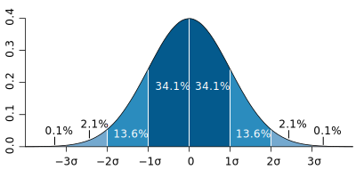

```{r setup, include=FALSE}
# golden ratio: 0.5*(1+sqrt(5))
knitr::opts_chunk$set(fig.width=10, fig.asp=(2/(1+sqrt(5))))
knitr::opts_chunk$set(echo = FALSE)
```

```{R preamble, include=FALSE}
options(bitmapType='cairo')
options(scipen = 999)
library(ggplot2)
library(dplyr)
library(tidyr)
library(readr)
set.seed(42)
```

titlepage

--- &vertical

## Statistics

> The practice or science of collecting and analysing numerical data in large quantities, especially for the purpose of inferring proportions in a whole from those in a representative sample.  
> [OED definition](http://www.oxforddictionaries.com/definition/english/statistics)

<!-- -->

> Statistics is the study of the collection, analysis, interpretation, presentation, and organization of data.  
> [The Oxford Dictionary of Statistical Terms](https://global.oup.com/academic/product/the-oxford-dictionary-of-statistical-terms-9780199206131?cc=de&lang=en&)

<!--
* *Descriptive statistics*
involves methods of organizing, picturing and summarizing information from data.  
* *Inferential statistics*
involves methods of using information from a sample to draw conclusions about the population.
-->

***

## Randomness

> The quality or state of lacking a pattern or principle of organization; unpredictability  
> [OED definition](http://www.oxforddictionaries.com/definition/english/randomness)

---

## History

- world's first statistics department at [University College London](https://www.ucl.ac.uk/statistics) in 1911
- born in WW2: [S-Branch](http://www.economist.com/news/christmas-specials/21636589-how-statisticians-changed-war-and-war-changed-statistics-they-also-served)
- RNG back then: lottery balls, and women picking "random" 

<!-- The central office, the war cabinet was told, would produce "a regular series of figures on a coherent and well-ordered basis... that will be accepted and used without question". The new statisticians worked on government accounts; rationing (which ensured no Britons starved and greatly improved the diet of the poorest third); manpower surveys; the "pay as you earn"" system of taxation (which raised the cash needed to wage the war); and the Beveridge Report on social insurance that later led to the founding of the welfare state.
-->

--- &vertical

## From Historgrams to  Distributions

### Graphs and Functions

<!-- from histogram to distribution -->

Punktdiagramm zum Einstieg: Spielerlevel x, anzahl Gold y

***

### Histograms

```{R commute-hist, warning=FALSE, message=FALSE}
# commute dataset
load("../commute-distances.Rdata")

# warning suppressed: non-finite values removed
dta.distance %>% 
  #filter(minutes < 120) %>% 
  ggplot()+
  geom_histogram(aes(x=minutes))+
  #geom_line(stat="density", aes(x=minutes), colour = "red")+
  xlim(0, 100)+
  labs(
    title = "Commute time of BB DUS employees", 
    y = NULL
  )
```

***

### Density estimates

```{R commute-hist-dens, warning=FALSE, message=FALSE}
# warning suppressed: non-finite values removed
dta.distance %>% 
  #filter(minutes < 120) %>% 
  ggplot()+
  geom_histogram(aes(x=minutes, y=..density..))+
  geom_line(stat="density", aes(x=minutes), colour = "red")+
  xlim(0, 100)+
  labs(
    title = "Commute time of BB DUS employees", 
    y = NULL
  )
```

***

### Uniform distribution

```{r uniform}
# x values for plotting
x <- seq(-5, 5, by = 0.01)

ggplot()+
  # uniform distribution
  geom_line(
    aes(x=x, y=dunif(x, -4, 4)), size = 1.5#, colour = cbgPalette[6]
  )+
  labs(x = "", y = "", title = "Uniform distribution")
```

Beispielrechnung mit konkreten Zahlen: D6

*** 

### Poisson (Count) distribution

```{r poisson}
ggplot()+
  # poisson distribution
  geom_point(
    aes(x=unique(as.integer(x)), y=dpois(unique(as.integer(x)), 2)), size = 3.5#, colour = cbgPalette[2]
  )+
  labs(x = "", y = "", title = "Poisson (Count) distribution")
```

*** 

### Normal (Gaussian) distribution

```{r gaussian}
ggplot()+
  # normal distribution
  geom_line(
    aes(x=x, y=dnorm(x)), size = 1.5#, colour = cbgPalette[6]
  )+
#   # lognormal distribution
#   geom_line(
#     aes(x=x, y=dlnorm(x)), size = 1.5, colour = cbgPalette[6]
#   )+
  labs(x = "", y = "", title = "(Standard-) Normal distribution")
```

--- &vertical

## explain distributions

- most (nice) distributions can be explained by *moments*
    - mean (average): $\mu = E[X]$
    - standard deviation/variance: $\sigma = \sqrt{E[(X-\mu)^2]}$
        - $\sigma = \sqrt{E[X^2] - (E[X])^2}$
- for the Normal distribution: $$X \sim \mathcal{N}(\mu,\sigma^2)$$

<!--
median, quartiles, Fehlererwartungen, Abweichung der Betrachtung, Steamspy settlers data
-->

***

### Mean and Standard Deviation



***

### Median

```{r median-steamspy, message = FALSE}
f.sum.sec <- function(t){
  time <- strsplit(trimws(t), split = ":")
  sapply(time, function(x){tt <- as.integer(x); return((tt[1]*60+tt[2])/3600)})
}

sspy <- readr::read_csv("../steamspy-2016-chart.csv") %>% 
  setNames(make.names(names(.))) %>% 
  tidyr::separate(Playtime..Median., c("playtime_avg", "playtime_med"), sep = "\\(", remove = FALSE) %>% 
  tidyr::separate(Owners, c("Owners.est", "Owners.CI"), sep = " ", remove = FALSE) %>% 
  mutate(
    playtime_avg_h = f.sum.sec(playtime_avg),
    playtime_med_h = f.sum.sec(gsub(")", "", playtime_med)),
    Owners.est = as.integer(gsub(",", "", Owners.est))
  )
```

<!-- sorted by avg playtime -->
knitr::kable(sspy %>% filter(Price != "Free" & Owners.est > 5000) %>% select(Game, Owners.est, playtime_avg_h, playtime_med_h) %>% arrange(-playtime_avg_h) %>% head(n=5))

<!-- sorted by median playtime -->
knitr::kable(sspy %>% filter(Price != "Free" & Owners.est > 5000) %>% select(Game, Owners.est, playtime_avg_h, playtime_med_h) %>% arrange(-playtime_med_h) %>% head(n=5))


***

### Others

- quartiles
- correlation

***

### summary

mean, variance, median, lognormal (tail distributions in games)


--- &vertical

## Bonus: Anscombe's Quartet

- Anscombe, Francis J. (1973) *Graphs in statistical analysis*. [American Statistician, 27, pp. 17–21.](http://www.sjsu.edu/faculty/gerstman/StatPrimer/anscombe1973.pdf)
- four $x, y$ datasets which have equal properties:
    - mean, variance, correlation, linear regression
    - $$y = 4 + 0.346x$$
- showcase for data exploration!

***

```{r anscombe}
anscombe.dta <- NULL
for(i in 1:4){
  anscombe.dta <- bind_rows(
    anscombe.dta, tibble(anscombe.set = letters[i], x = anscombe[, i], y = anscombe[, i+4])
  )
}

anscombe.dta %>% 
  ggplot(aes(x, y))+
  geom_point()+
  geom_smooth(method = "lm", se = FALSE)+
  facet_grid(. ~ anscombe.set)+
  labs(
    x = "x-values", y = "y-values", title = "Anscombe's Quartet"
  )

```


--- &vertical

## Correlation vs Causation

> (Statistics) A quantity measuring the extent of the interdependence of variable quantities.  
> [OED definition](https://en.oxforddictionaries.com/definition/correlation)

***

```{R correlation}
# correlation

cor.dta <- data.frame( 
  x = runif(100, min = 0, max = 10)
) %>% 
  mutate(
    a = x + runif(100, -1, 1), 
    b = x + runif(100, -1, 1)
  )

gg <- ggplot(cor.dta)+
  geom_point()+
  aes(x=a, y=b)+
  geom_smooth()+
  labs(x=NULL, y=NULL, title = "Scatterplot of A and B")
gg
```

***

```{R correlation-exposed}
gg+
  geom_text(aes(x = 1, y = 9), label = "A=X+U[-1,1]\n B=X+U[-1,1]\n X~U[0,10]", hjust=0)
```

---

## Linear Regression

$$y_i = \beta_0 + \beta_i + \varepsilon_i$$

- fitted values: $$\hat y = b_0 + b_ix_i$$
- residuals: $$e_i = y_i - \hat y_i$$


---

- statistical difference/significance
    - show how two data dots come from the same distribution and can be different
    - t-test 
- representative Stichprobe, zB hohe level, wenig Spieler, Ausreisser/Verzerrung

---

## common mistakes

- filtern nach sample
    - filter bias
- samples have too few players
    - outliers (also: cheats)
- avg vs mean (steamspy)
    - distributions are important(!)
- correlation is not causation
- summing of data over variables (levels)
- self-selection
- check validity of data
    - check for cheats


---

<!--
Lesson 1: Visualizing relationships in data

Seeing relationships in data and predicting based on them; Simpson's paradox
Lesson 2: Probability

Probability; Bayes Rule; Correlation vs. Causation
Lesson 3: Estimation

Maximum Likelihood Estimation; Mean, Median, Mode; Standard Deviation, Variance
Lesson 4: Outliers and Normal Distribution

Outliers, Quartiles; Binomial Distribution; Central Limit Theorem; Manipulating Normal Distribution
Lesson 5: Inference

Confidence intervals; Hypothesis Testing
Lesson 6: Regression

Linear regression; correlation
Lesson 7: Final Exam
-->


