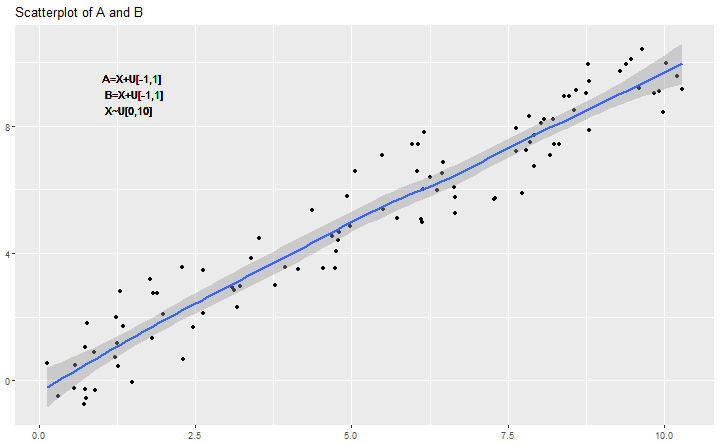

titlepage
>>>>>>> fd6862ba04b78c4d49b9a63941c73347c8db8f46


--- &vertical

## Statistics

<<<<<<< HEAD
> The practice or science of collecting and analysing numerical data in large quantities, especially for the purpose of inferring proportions in a whole from those in a representative sample.  
> [OED definition](http://www.oxforddictionaries.com/definition/english/statistics)

***

> Statistics is the study of the collection, analysis, interpretation, presentation, and organization of data.  
=======
> The practice or science of collecting and analysing numerical data in large quantities, especially for the purpose of inferring proportions in a whole from those in a representative sample.   
> [OED definition](http://www.oxforddictionaries.com/definition/english/statistics)

<!-- -->

> Statistics is the study of the collection, analysis, interpretation, presentation, and organization of data.   
>>>>>>> fd6862ba04b78c4d49b9a63941c73347c8db8f46
> [The Oxford Dictionary of Statistical Terms](https://global.oup.com/academic/product/the-oxford-dictionary-of-statistical-terms-9780199206131?cc=de&lang=en&)

<!--
* *Descriptive statistics*
involves methods of organizing, picturing and summarizing information from data.  
* *Inferential statistics*
involves methods of using information from a sample to draw conclusions about the population.
-->

***

## Randomness

> The quality or state of lacking a pattern or principle of organization; unpredictability  
> [OED definition](http://www.oxforddictionaries.com/definition/english/randomness)

---

## History

<<<<<<< HEAD
- world's first statistics department at University College London ([UCL](https://www.ucl.ac.uk/statistics)) in 1911
- born in WW2: [S-Branch](http://www.economist.com/news/christmas-specials/21636589-how-statisticians-changed-war-and-war-changed-statistics-they-also-served)
- RNG: lottery balls, and women picking at "random" 

<!-- The central office, the war cabinet was told, would produce "a regular series of figures on a coherent and well-ordered basis... that will be accepted and used without question". The new statisticians worked on government accounts; rationing (which ensured no Britons starved and greatly improved the diet of the poorest third); manpower surveys; the "pay as you earn"" system of taxation (which raised the cash needed to wage the war); and the Beveridge Report on social insurance that later led to the founding of the welfare state.
-->

=======
- world's first statistics department at [University College London](https://www.ucl.ac.uk/statistics) in 1911
- born in WW2: [S-Branch](http://www.economist.com/news/christmas-specials/21636589-how-statisticians-changed-war-and-war-changed-statistics-they-also-served)
- RNG back then: lottery balls, and women picking at "random" 

<!-- The central office, the war cabinet was told, would produce "a regular series of figures on a coherent and well-ordered basis... that will be accepted and used without question". The new statisticians worked on government accounts; rationing (which ensured no Britons starved and greatly improved the diet of the poorest third); manpower surveys; the "pay as you earn" system of taxation (which raised the cash needed to wage the war); and the Beveridge Report on social insurance that later led to the founding of the welfare state.
-->


>>>>>>> fd6862ba04b78c4d49b9a63941c73347c8db8f46
--- &vertical

## From Histograms to  Distributions

### Graphs and Functions

<<<<<<< HEAD
<!-- from histogram to distribution -->

=======
>>>>>>> fd6862ba04b78c4d49b9a63941c73347c8db8f46
Punktdiagramm zum Einstieg: Spielerlevel x, anzahl Gold y

***

### Histograms

<<<<<<< HEAD

```r
# commute dataset
load("../commute-distances.Rdata")

# warning suppressed: non-finite values removed
dta.distance %>% 
  #filter(minutes < 120) %>% 
  ggplot()+
  geom_histogram(aes(x=minutes))+
  #geom_line(stat="density", aes(x=minutes), colour = "red")+
  xlim(0, 100)+
  labs(
    title = "Commute time of BB DUS employees", 
    y = NULL
  )
```

=======
>>>>>>> fd6862ba04b78c4d49b9a63941c73347c8db8f46


***

### Density estimates

<<<<<<< HEAD

```r
# warning suppressed: non-finite values removed
dta.distance %>% 
  #filter(minutes < 120) %>% 
  ggplot()+
  geom_histogram(aes(x=minutes, y=..density..))+
  geom_line(stat="density", aes(x=minutes), colour = "red", size = 2)+
  xlim(0, 100)+
  labs(
    title = "Commute time of BB DUS employees", 
    y = NULL
  )
```

=======
>>>>>>> fd6862ba04b78c4d49b9a63941c73347c8db8f46


***

### Probability Density Function

> A function of a discrete variable whose integral over any interval is the probability that the variate specified by it will lie within that interval.  
> [OED dictionary](https://en.oxforddictionaries.com/definition/probability_distribution)

<!--
- The area bounded by the curve of the density function and the x-axis is equal to 1, when computed over the domain of the variable.
- The probability that a random variable assumes a value between a and b is equal to the area under the density function bounded by a and b. 
-->

<<<<<<< HEAD
=======

>>>>>>> fd6862ba04b78c4d49b9a63941c73347c8db8f46
--- &vertical

## Density Functions and Distributions

### Uniform distribution

<<<<<<< HEAD

```r
# x values for plotting
x <- seq(1, 6, by = 1)

ggplot()+
  # uniform distribution
  geom_bar(
    aes(x=x, y = (..count..)/sum(..count..)), size = 1.5#, colour = cbgPalette[6]
  )+
  labs(x = "", y = "", title = "Uniform distribution", subtitle = "A D6 die roll")+
  # theme(
  #   axis.text.y = element_blank(),
  #   axis.ticks.y = element_blank()
  # )+
  scale_x_continuous(breaks = 1:6)#+
```


```r
  #scale_y_continuous(labels = percent)
```

=======


Beispielrechnung mit konkreten Zahlen: D6
>>>>>>> fd6862ba04b78c4d49b9a63941c73347c8db8f46

*** 

### Poisson (Count) distribution

<<<<<<< HEAD

```r
ggplot()+
  # poisson distribution
  geom_point(
    aes(x=unique(as.integer(x)), y=dpois(unique(as.integer(x)), 2)), size = 3.5#, colour = cbgPalette[2]
  )+
  labs(x = "", y = "", title = "Poisson (Count) distribution")
```

=======
>>>>>>> fd6862ba04b78c4d49b9a63941c73347c8db8f46


*** 

### Normal (Gaussian) distribution

<<<<<<< HEAD

```r
x <- seq(-5, 5, by = 0.01)
ggplot()+
  # normal distribution
  geom_line(
    aes(x=x, y=dnorm(x)), size = 1.5#, colour = cbgPalette[6]
  )+
#   # lognormal distribution
#   geom_line(
#     aes(x=x, y=dlnorm(x)), size = 1.5, colour = cbgPalette[6]
#   )+
  labs(x = "", y = "", title = "(Standard-) Normal distribution")
```


=======


>>>>>>> fd6862ba04b78c4d49b9a63941c73347c8db8f46
--- &vertical

## explain distributions

- most (nice) distributions can be explained by *moments*
    - mean (average): $\mu = E[X]$
<<<<<<< HEAD
    - standard deviation/variance: 
      $$\sigma^2 = E[(X-\mu)^2]$$ 
=======
    - standard deviation/variance: $\sigma = \sqrt{E[(X-\mu)^2]}$
        - $\sigma = \sqrt{E[X^2] - (E[X])^2}$
>>>>>>> fd6862ba04b78c4d49b9a63941c73347c8db8f46
- for the Normal distribution: $$X \sim \mathcal{N}(\mu,\sigma^2)$$

<!--
median, quartiles, Fehlererwartungen, Abweichung der Betrachtung, Steamspy settlers data
<<<<<<< HEAD
$\sigma = \sqrt{E[X^2] - (E[X])^2}$
=======
>>>>>>> fd6862ba04b78c4d49b9a63941c73347c8db8f46
-->

***

### (Statistical) Mean 

- the expected value
- arithmetic mean: $1/n \sum x_i$ 

***

### Standard Deviation

<<<<<<< HEAD

=======

>>>>>>> fd6862ba04b78c4d49b9a63941c73347c8db8f46

***

### Median

- the *50% observation*
- more resistant to outliers than the mean
- example: D10 roll $X = {1, 1, 1, 1, 10}$
    - mean: 2.8
    - median: 1

***


<<<<<<< HEAD
### Steamspy data: by average


```r
#<!-- sorted by avg playtime -->
sspy %>% 
  filter(Price != "Free" & Owners.est > 5000) %>% 
  select(Game, Owners.est, playtime_avg_h, playtime_med_h) %>% 
  arrange(-playtime_avg_h) %>% 
  head(n=5) %>% 
  kable("html") %>% 
  kable_styling(font_size = 20) %>% 
  row_spec(0, bold = TRUE)
```

<table class="table" style="font-size: 20px; margin-left: auto; margin-right: auto;">
<thead><tr>
<th style="text-align:left;font-weight: bold;"> Game </th>
   <th style="text-align:right;font-weight: bold;"> Owners.est </th>
   <th style="text-align:right;font-weight: bold;"> playtime_avg_h </th>
   <th style="text-align:right;font-weight: bold;"> playtime_med_h </th>
  </tr></thead>
<tbody>
<tr>
<td style="text-align:left;"> Livelock </td>
   <td style="text-align:right;"> 7142 </td>
   <td style="text-align:right;"> 4.558333 </td>
   <td style="text-align:right;"> 0.0358333 </td>
  </tr>
<tr>
<td style="text-align:left;"> Out of the Park Baseball 17 </td>
   <td style="text-align:right;"> 15384 </td>
   <td style="text-align:right;"> 2.574167 </td>
   <td style="text-align:right;"> 0.6594444 </td>
  </tr>
<tr>
<td style="text-align:left;"> NOBUNAGA'S AMBITION: Souzou SengokuRisshiden </td>
   <td style="text-align:right;"> 42855 </td>
   <td style="text-align:right;"> 2.213889 </td>
   <td style="text-align:right;"> 1.1980556 </td>
  </tr>
<tr>
<td style="text-align:left;"> INFRA </td>
   <td style="text-align:right;"> 9340 </td>
   <td style="text-align:right;"> 2.129444 </td>
   <td style="text-align:right;"> 0.0566667 </td>
  </tr>
<tr>
<td style="text-align:left;"> Naval Action </td>
   <td style="text-align:right;"> 84977 </td>
   <td style="text-align:right;"> 1.594444 </td>
   <td style="text-align:right;"> 0.2552778 </td>
  </tr>
</tbody>
</table>

***

### Steamspy data: by median


```r
#<!-- sorted by median playtime -->
sspy %>% 
  filter(Price != "Free" & Owners.est > 5000) %>% 
  select(Game, Owners.est, playtime_avg_h, playtime_med_h) %>% 
  arrange(-playtime_med_h) %>% 
  head(n=5) %>% 
  kable("html") %>% 
  kable_styling(font_size = 20) %>% 
  row_spec(0, bold = TRUE)
```

<table class="table" style="font-size: 20px; margin-left: auto; margin-right: auto;">
<thead><tr>
<th style="text-align:left;font-weight: bold;"> Game </th>
   <th style="text-align:right;font-weight: bold;"> Owners.est </th>
   <th style="text-align:right;font-weight: bold;"> playtime_avg_h </th>
   <th style="text-align:right;font-weight: bold;"> playtime_med_h </th>
  </tr></thead>
<tbody>
<tr>
<td style="text-align:left;"> NOBUNAGA'S AMBITION: Souzou SengokuRisshiden </td>
   <td style="text-align:right;"> 42855 </td>
   <td style="text-align:right;"> 2.213889 </td>
   <td style="text-align:right;"> 1.1980556 </td>
  </tr>
<tr>
<td style="text-align:left;"> DARK SOULS III </td>
   <td style="text-align:right;"> 1067158 </td>
   <td style="text-align:right;"> 1.128333 </td>
   <td style="text-align:right;"> 0.8391667 </td>
  </tr>
<tr>
<td style="text-align:left;"> Tom Clancy's The Division </td>
   <td style="text-align:right;"> 784206 </td>
   <td style="text-align:right;"> 1.528056 </td>
   <td style="text-align:right;"> 0.8344444 </td>
  </tr>
<tr>
<td style="text-align:left;"> Hearts of Iron IV </td>
   <td style="text-align:right;"> 338077 </td>
   <td style="text-align:right;"> 1.159722 </td>
   <td style="text-align:right;"> 0.6947222 </td>
  </tr>
<tr>
<td style="text-align:left;"> Ascent - The Space Game </td>
   <td style="text-align:right;"> 17032 </td>
   <td style="text-align:right;"> 1.081944 </td>
   <td style="text-align:right;"> 0.6894444 </td>
  </tr>
</tbody>
</table>
=======
<!-- sorted by avg playtime -->
knitr::kable(sspy %>% filter(Price != "Free" & Owners.est > 5000) %>% select(Game, Owners.est, playtime_avg_h, playtime_med_h) %>% arrange(-playtime_avg_h) %>% head(n=5))

<!-- sorted by median playtime -->
knitr::kable(sspy %>% filter(Price != "Free" & Owners.est > 5000) %>% select(Game, Owners.est, playtime_avg_h, playtime_med_h) %>% arrange(-playtime_med_h) %>% head(n=5))


***

### Others

- quartiles
>>>>>>> fd6862ba04b78c4d49b9a63941c73347c8db8f46

***

### summary

<<<<<<< HEAD
- mean, variance, median, (log-)normal
- game data often has a large tail distribution
- the density curve is always preferable to a moment 
=======
- mean, variance, median, lognormal (tail distributions in games)
- the density curve is always preferable to a moment! 
>>>>>>> fd6862ba04b78c4d49b9a63941c73347c8db8f46


--- &vertical

## Bonus: Anscombe's Quartet

- Anscombe, Francis J. (1973) *Graphs in statistical analysis*. [American Statistician, 27, pp. 17–21.](http://www.sjsu.edu/faculty/gerstman/StatPrimer/anscombe1973.pdf)
- four $x, y$ datasets which have equal properties:
<<<<<<< HEAD
    - mean $(9, 7.5)$, variance $(11, 4.12)$, correlation $(0.816)$ 
=======
    - mean (9, 7.5), variance (11, 4.12), correlation (0.816) 
>>>>>>> fd6862ba04b78c4d49b9a63941c73347c8db8f46
    - linear regression: $y = 4 + 0.346x$
- showcase for data exploration!

***

<<<<<<< HEAD

```r
anscombe.dta <- NULL
for(i in 1:4){
  anscombe.dta <- bind_rows(
    anscombe.dta, tibble(anscombe.set = letters[i], x = anscombe[, i], y = anscombe[, i+4])
  )
}

anscombe.dta %>% 
  ggplot(aes(x, y))+
  geom_point()+
  geom_smooth(method = "lm", se = FALSE)+
  facet_grid(. ~ anscombe.set)+
  labs(
    x = "x-values", y = "y-values", title = "Anscombe's Quartet"
  )
```


=======


--- &vertical

## Bonus bonus: The Datasaurus

https://www.autodeskresearch.com/publications/samestats
https://github.com/stephlocke/datasauRus


>>>>>>> fd6862ba04b78c4d49b9a63941c73347c8db8f46


--- &vertical

## Correlation vs Causation

> (Statistics) A quantity measuring the extent of the interdependence of variable quantities.  
> [OED definition](https://en.oxforddictionaries.com/definition/correlation)

<<<<<<< HEAD
<!-- -->

=======
>>>>>>> fd6862ba04b78c4d49b9a63941c73347c8db8f46
> The action of causing something.  
> [OED definition](https://en.oxforddictionaries.com/definition/causation)

***

<<<<<<< HEAD

```r
# correlation

cor.dta <- data.frame( 
  x = runif(100, min = 0, max = 10)
) %>% 
  mutate(
    a = x + runif(100, -1, 1), 
    b = x + runif(100, -1, 1)
  )

gg <- ggplot(cor.dta)+
  geom_point()+
  aes(x=a, y=b)+
  geom_smooth()+
  labs(x=NULL, y=NULL, title = "Scatterplot of A and B")
gg
```

=======
>>>>>>> fd6862ba04b78c4d49b9a63941c73347c8db8f46


***

<<<<<<< HEAD

```r
gg+
  geom_text(aes(x = 1, y = 9), label = "A=X+U[-1,1]\n B=X+U[-1,1]\n X~U[0,10]", hjust=0)
```




---&vertical

## Bayes' Rule

- conditional probability
- _prior_ and _posterior_ knowledge
- assume: 
    - $p(A) = \text{prob of a payer} = 0.05$
    - $p(B) = \text{prob of pvp} = 0.2$
    - $p(B|A) = 0.8$
    
***

- how high is the chance of a player being a payer, given that he plays PvP? 

$$p(A|B) = \frac{p(B|A)*p(A)}{p(B)}$$ 

<!--
answer: 0.8*0.05/0.2 = 0.2 > 0.05

tests: number of false positives outweights true positives

https://www.eecs.qmul.ac.uk/~norman/BBNs/Bayes_rule.htm
-->

<!--
=======


***

### Bayes' Rule

- asdf

---

## Bayes' Rule

$$p(A|B) = \frac{p(B|A)*p(A)}{p(B)}$$ 

https://www.eecs.qmul.ac.uk/~norman/BBNs/Bayes_rule.htm

>>>>>>> fd6862ba04b78c4d49b9a63941c73347c8db8f46
---

## Linear Regression

$$y_i = \beta_0 + \beta_i + \varepsilon_i$$

- fitted values: $$\hat y = b_0 + b_ix_i$$
- residuals: $$e_i = y_i - \hat y_i$$

<<<<<<< HEAD
-->

--- &vertical

## Statistical tests

- statistical difference/significance
    - show how two data dots come from the same distribution and can be different
- representative sample
    - high levels, few players, biases
    - self-selection! 
- validity of a test
    - Type I error: reject true Null ("false positive")
    - Type II error: do not reject false Null ("false negative")

***


```r
ggplot()+
  geom_line(aes(x = d1, y = dnorm(d1)), size = 2, colour = "#16A085")+
  annotate("text", x = -2.5, y = 0.12, label = "d1 == N(-1.5, 0)", colour = "#6ACEEB", parse = TRUE)+
  geom_line(aes(x = d1, y = dnorm(d1+1.5)), size = 2, colour = "#6ACEEB")+
  annotate("text", x = -2, y = 0.01, label = "d2 == N(0, 0)", colour = "#16A085", parse = TRUE)+
  geom_vline(xintercept = -0.5)+
  annotate("text", x = -0.45, y = 0.01, label = "x = -0.5", hjust = 0)+
  labs(
    x = "", y = "density",
    title = "Is x from distribution d1 or d2?"
  )
```


=======

---

- statistical difference/significance
    - show how two data dots come from the same distribution and can be different
    - t-test 
- representative Stichprobe, zB hohe level, wenig Spieler, Ausreisser/Verzerrung
>>>>>>> fd6862ba04b78c4d49b9a63941c73347c8db8f46

---

## common mistakes

<<<<<<< HEAD
- check validity of data (cheats/QA)
- filter bias
- samples may have too few players
- outliers _will_ happen (also: cheats)
- avg vs mean (steamspy)
    - distributions are important!
- summing of data over variables (levels)
    - lower levels have more players, so sums are much(!) larger
- correlation is not causation
- self-selection


--- ds:thanks

## Happy stat-ing!
=======
- filtern nach sample
    - filter bias
- samples have too few players
    - outliers (also: cheats)
- avg vs mean (steamspy)
    - distributions are important(!)
- correlation is not causation
- summing of data over variables (levels)
    - lower levels have more players, so sums are much(!) larger
- self-selection
- check validity of data
    - check for cheats


---
>>>>>>> fd6862ba04b78c4d49b9a63941c73347c8db8f46

<!--
Lesson 1: Visualizing relationships in data

Seeing relationships in data and predicting based on them; Simpson's paradox
Lesson 2: Probability

Probability; Bayes Rule; Correlation vs. Causation
Lesson 3: Estimation

Maximum Likelihood Estimation; Mean, Median, Mode; Standard Deviation, Variance
Lesson 4: Outliers and Normal Distribution

Outliers, Quartiles; Binomial Distribution; Central Limit Theorem; Manipulating Normal Distribution
Lesson 5: Inference

Confidence intervals; Hypothesis Testing
Lesson 6: Regression

Linear regression; correlation
Lesson 7: Final Exam
-->


