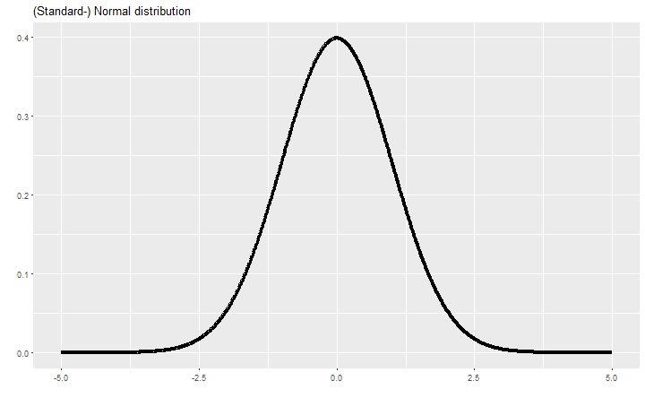

--- &vertical

## Statistics

> The practice or science of collecting and analysing numerical data in large quantities, especially for the purpose of inferring proportions in a whole from those in a representative sample.  
> [OED definition](http://www.oxforddictionaries.com/definition/english/statistics)

> Statistics is the study of the collection, analysis, interpretation, presentation, and organization of data.  
> Dodge, Y. (2006) The Oxford Dictionary of Statistical Terms, OUP. ISBN 0-19-920613-9

<!--
* *Descriptive statistics*
involves methods of organizing, picturing and summarizing information from data.  
* *Inferential statistics*
involves methods of using information from a sample to draw conclusions about the population.
-->

***

## Randomness

> The quality or state of lacking a pattern or principle of organization; unpredictability  
> [OED definition](http://www.oxforddictionaries.com/definition/english/randomness)

---

## History

- world's first statistics department at [University College London](https://www.ucl.ac.uk/statistics) in 1911
- born in WW2: [S-Branch](http://www.economist.com/news/christmas-specials/21636589-how-statisticians-changed-war-and-war-changed-statistics-they-also-served)
- RNG back then: lottery balls, and women picking "random" 

<!-- The central office, the war cabinet was told, would produce "a regular series of figures on a coherent and well-ordered basis... that will be accepted and used without question". The new statisticians worked on government accounts; rationing (which ensured no Britons starved and greatly improved the diet of the poorest third); manpower surveys; the "pay as you earn"" system of taxation (which raised the cash needed to wage the war); and the Beveridge Report on social insurance that later led to the founding of the welfare state.
-->

--- &vertical

## Distributions

<!-- from histogram to distribution -->

### Histogram

***

### Density estimates

***

### Uniform distribution

*** 

### Poisson (Count) distribution

*** 

### Normal (Gaussian) distribution

---

## explain distributions

- mean (average)
- standard deviation/variance
- median
- quartiles
- Fehlerwartungen: avg vs median, Veränderung der Betrachtung, steamspy Settlers data

---

- correlation
    - correlation vs causation: show how a third data point can drive the first two correlations

***

---

- statistical difference/significance
    - show how two data dots come from the same distribution and can be different
    - t-test 

Anscombe's quartet

---

asdf

---

Lesson 1: Visualizing relationships in data

Seeing relationships in data and predicting based on them; Simpson's paradox
Lesson 2: Probability

Probability; Bayes Rule; Correlation vs. Causation
Lesson 3: Estimation

Maximum Likelihood Estimation; Mean, Median, Mode; Standard Deviation, Variance
Lesson 4: Outliers and Normal Distribution

Outliers, Quartiles; Binomial Distribution; Central Limit Theorem; Manipulating Normal Distribution
Lesson 5: Inference

Confidence intervals; Hypothesis Testing
Lesson 6: Regression

Linear regression; correlation
Lesson 7: Final Exam

---

