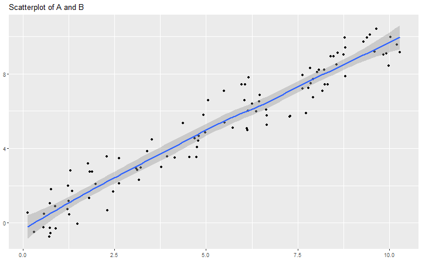

titlepage

--- &vertical

## Statistics

> The practice or science of collecting and analysing numerical data in large quantities, especially for the purpose of inferring proportions in a whole from those in a representative sample.   
> [OED definition](http://www.oxforddictionaries.com/definition/english/statistics)

<!-- -->

> Statistics is the study of the collection, analysis, interpretation, presentation, and organization of data.   
> [The Oxford Dictionary of Statistical Terms](https://global.oup.com/academic/product/the-oxford-dictionary-of-statistical-terms-9780199206131?cc=de&lang=en&)

<!--
* *Descriptive statistics*
involves methods of organizing, picturing and summarizing information from data.  
* *Inferential statistics*
involves methods of using information from a sample to draw conclusions about the population.
-->

***

## Randomness

> The quality or state of lacking a pattern or principle of organization; unpredictability  
> [OED definition](http://www.oxforddictionaries.com/definition/english/randomness)

---

## History

- world's first statistics department at [University College London](https://www.ucl.ac.uk/statistics) in 1911
- born in WW2: [S-Branch](http://www.economist.com/news/christmas-specials/21636589-how-statisticians-changed-war-and-war-changed-statistics-they-also-served)
- RNG back then: lottery balls, and women picking at "random" 

<!-- The central office, the war cabinet was told, would produce "a regular series of figures on a coherent and well-ordered basis... that will be accepted and used without question". The new statisticians worked on government accounts; rationing (which ensured no Britons starved and greatly improved the diet of the poorest third); manpower surveys; the "pay as you earn" system of taxation (which raised the cash needed to wage the war); and the Beveridge Report on social insurance that later led to the founding of the welfare state.
-->

--- &vertical

## From Histograms to  Distributions

### Graphs and Functions

Punktdiagramm zum Einstieg: Spielerlevel x, anzahl Gold y

***

### Histograms

***

### Density estimates

***

### Probability Density Function

> A function of a discrete variable whose integral over any interval is the probability that the variate specified by it will lie within that interval.  
> [OED dictionary](https://en.oxforddictionaries.com/definition/probability_distribution)

<!--
- The area bounded by the curve of the density function and the x-axis is equal to 1, when computed over the domain of the variable.
- The probability that a random variable assumes a value between a and b is equal to the area under the density function bounded by a and b. 
-->

--- &vertical

## Density Functions and Distributions

### Uniform distribution

Beispielrechnung mit konkreten Zahlen: D6

*** 

### Poisson (Count) distribution

*** 

### Normal (Gaussian) distribution

--- &vertical

## explain distributions

- most (nice) distributions can be explained by *moments*
    - mean (average): $\mu = E[X]$
    - standard deviation/variance: $\sigma = \sqrt{E[(X-\mu)^2]}$
        - $\sigma = \sqrt{E[X^2] - (E[X])^2}$
- for the Normal distribution: $$X \sim \mathcal{N}(\mu,\sigma^2)$$

<!--
median, quartiles, Fehlererwartungen, Abweichung der Betrachtung, Steamspy settlers data
-->

***

### (Statistical) Mean 

- the expected value
- arithmetic mean: $1/n \sum x_i$ 

***

### Standard Deviation

***

### Median

- the *50% observation*
- more resistant to outliers than the mean
- example: D10 roll $X = {1, 1, 1, 1, 10}$
    - mean: 2.8
    - median: 1

***

<!-- sorted by avg playtime -->
knitr::kable(sspy %>% filter(Price != "Free" & Owners.est > 5000) %>% select(Game, Owners.est, playtime_avg_h, playtime_med_h) %>% arrange(-playtime_avg_h) %>% head(n=5))

<!-- sorted by median playtime -->
knitr::kable(sspy %>% filter(Price != "Free" & Owners.est > 5000) %>% select(Game, Owners.est, playtime_avg_h, playtime_med_h) %>% arrange(-playtime_med_h) %>% head(n=5))

***

### Others

- quartiles

***

### summary

- mean, variance, median, lognormal (tail distributions in games)
- the density curve is always preferable to a moment! 

--- &vertical

## Bonus: Anscombe's Quartet

- Anscombe, Francis J. (1973) *Graphs in statistical analysis*. [American Statistician, 27, pp. 17–21.](http://www.sjsu.edu/faculty/gerstman/StatPrimer/anscombe1973.pdf)
- four $x, y$ datasets which have equal properties:
    - mean (9, 7.5), variance (11, 4.12), correlation (0.816) 
    - linear regression: $y = 4 + 0.346x$
- showcase for data exploration!

***

--- &vertical

## Bonus bonus: The Datasaurus

https://www.autodeskresearch.com/publications/samestats
https://github.com/stephlocke/datasauRus

--- &vertical

## Correlation vs Causation

> (Statistics) A quantity measuring the extent of the interdependence of variable quantities.  
> [OED definition](https://en.oxforddictionaries.com/definition/correlation)

> The action of causing something.  
> [OED definition](https://en.oxforddictionaries.com/definition/causation)

***

***

***

### Bayes' Rule

- asdf

---

## Bayes' Rule

$$p(A|B) = \frac{p(B|A)*p(A)}{p(B)}$$ 

https://www.eecs.qmul.ac.uk/~norman/BBNs/Bayes_rule.htm

---

## Linear Regression

$$y_i = \beta_0 + \beta_i + \varepsilon_i$$

- fitted values: $$\hat y = b_0 + b_ix_i$$
- residuals: $$e_i = y_i - \hat y_i$$

---

- statistical difference/significance
    - show how two data dots come from the same distribution and can be different
    - t-test 
- representative Stichprobe, zB hohe level, wenig Spieler, Ausreisser/Verzerrung

---

## common mistakes

- filtern nach sample
    - filter bias
- samples have too few players
    - outliers (also: cheats)
- avg vs mean (steamspy)
    - distributions are important(!)
- correlation is not causation
- summing of data over variables (levels)
    - lower levels have more players, so sums are much(!) larger
- self-selection
- check validity of data
    - check for cheats

---

<!--
Lesson 1: Visualizing relationships in data

Seeing relationships in data and predicting based on them; Simpson's paradox
Lesson 2: Probability

Probability; Bayes Rule; Correlation vs. Causation
Lesson 3: Estimation

Maximum Likelihood Estimation; Mean, Median, Mode; Standard Deviation, Variance
Lesson 4: Outliers and Normal Distribution

Outliers, Quartiles; Binomial Distribution; Central Limit Theorem; Manipulating Normal Distribution
Lesson 5: Inference

Confidence intervals; Hypothesis Testing
Lesson 6: Regression

Linear regression; correlation
Lesson 7: Final Exam
-->

